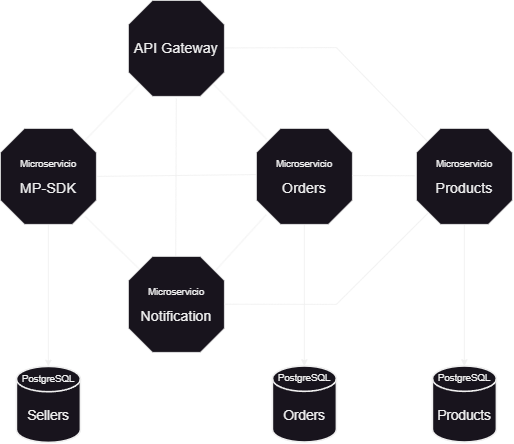

<h1 align="center">Microservices-based backend server</h1>

    

<h3>Microservices:</h3>

- API Gateway ❌
- Mercado-Pago service ✅
- Orders service ✅
- Products service ✅
- Notification service ❌

<h3>Databases PostgreSQL</h3>

- Sellers ✅
- Orders ✅
- Products ✅