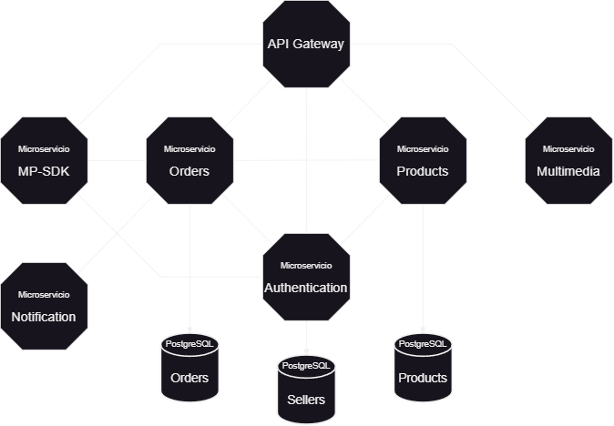

<h1 align="center">Microservices-based backend server</h1>

    

    <a href="https://github.com/flipps12/backend-shop-microservice-v1">
         
    </a>

<h3>Microservices:</h3>

- API Gateway ✅
- Authentication ✅
- Mercado-Pago service ✅
- Orders service ✅
- Products service ✅
- Multimedia service ❌
- Notification service ✅

<h3>Databases PostgreSQL</h3>

- Sellers ✅
- Orders ✅
- Products ✅

<h3>APIs:</h3>

- /server
- /api/auth
- /api/email
- /api/mercado-pago
- /api/product
- /api/order

<h4>Env</h4>

- Auth service
    - JWT_SECRET
    - AES_KEY
- MP service
    - URL
    - AES_KEY
- Notification service
    - MAIL_USER
    - MAIL_PASSWORD